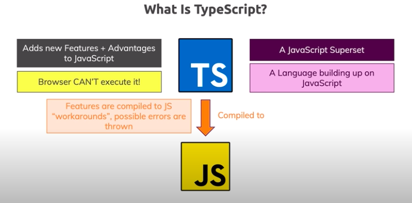

**TypeScript Course for Beginners 2020 - Learn TypeScript from Scratch!** from Academind

https://youtu.be/BwuLxPH8IDs

##typeScript 學習



-

### 1. 安裝

`npm install typescript --save-dev`

確認安裝: `tsc -v`

-

瀏覽器無法識別 typeScript，必須先轉成 JavaScript

==

###2. 特性

TypeScript adds: 

+ Types!
+ Next-gen JavaScript Features(compiled down for older Browsers)
+ Non-JavaScript Features like Interfaces or Generics
+ Meta-Programming Features like Decorators
+ Rich Configuration Options
+ Modern Tooling that helps even in non-TypeScript Projects

----

### 3. Core Types

-

```js
//13 種類型
1. number
2. string
3. boolean
4. object
5. array
6. tuple
7. Enum
8. Any
9. union
10. literal
11. Function
12. unknown
13. Never
```

-

+ **number** ( All number | no differences between integers or floats)
+ **string**
+ **boolean**

<p style="color: yellowgreen">TypeScript's type system only helps you during development(i.e. before the code gets compiled)</p>

**Key difference:** 

JavaScript uses "dynamic types" | TypeScript uses "static types"

+ **object** 

```js
//key - type pair
const person:{
    name: string;
    age: number;
}
----
const person: {
  name: string;
  age: number;  //描述详细
} = {
  name: 'aivon',
  age: 20
}
console.log(person.name)
```

+ **Array** (type can be flexible or strict)

+ **Tuple** (*Added by TS*: Fixed-length array) 有點像設定好規則的數組(長度，每組類別)

  `role: [number, string]`

+ **Enum** `enum {NEW, OLD}` (*Added by TS*: Automatically enumerated global constant identifiers

  `enum Role { ADMIN = 5, READ_ONLY = 'READ_ONLY', AUTHOR}`

  如果不設定值 則從 0 開始，逐次加一。可以是數字 可以是字符串。反正逐次加一。

+ **Any** * (Any kind of value, no specific type assignment)

---

### 4. Union Type

number | string

### 5. Literal Type

文本类型？

`'as-number' | 'as-text'`

### 6. Type Alias

在最上方: `type Combinable = number | string` [可以使用 Combinable 替代 后面的]

### 7. Function Return Type and Void

```js
//function add type number
function add(n1: number, n2: number){
  return n1 + n2
}

//function printResult does not return anything,then type void
function printResult(num: number){
  console.log('Result: ' + num);
}
-
let someValue: undefined //undefined 是 TS 的一个 Type，不报错。但永久就是 undefined。
-
function printResult(num: number): void{
  console.log('Result: ' + num);
  //加上 return; 也没错
}
function printResult(num: number): undefined{
  console.log('Result: ' + num);
  return;
}
```

### 8. Function Type

`let combineValues: Function`
`let combineValues: (a: number, b: number) => number` (规定再细一些)

### 9. Call backs

```js
function addAndHandle(n1: number, n2: number, cb: (num: number) => void){
  const result = n1 + n2
  cb(result)
}
```

---

### 10. Unknown Type

'unknown' is a little bit more restrictive than 'any'

###11. Never Type

```js
function generateError(message: string, code: number): never{
  throw {message: message, errorCode: code}
}
generateError('An error occurred!', 500)
```

----

---

### 12. TS Compiler

+ Watch Node

  輸入命令行 `tsc app.ts --watch` 或 直接 `-w`

  無需每次 tsc app.ts | 自動 recompiled

+ 如果有很多 TS 文件：

  輸入命令行 `tsc --init` （整個程式作為 TS 項目 -> 自動生成 tsconfig.json）

  之後可以直接 `tsc` 進行 compile 了（若進入 Watch Node：`tsc -w`）


### 13. 修改 tsconfig.json

1. compile 不包括的文件設定 | "exclude"

   ```js
   "exclude": [
       'analytics.ts', //specific file
       '*.dev.ts', //any files with ext .dev.ts
       '**/*.dev.ts', //any files with ext .dev.ts in any folders
       'node_modules', //folder (注意：node_modules 已經是默認不會被 compile)
   ]
   ```

2. compile 包括的文件設定 | "include"

   ```js
   "include": [
   	"app.ts"
     ]
   ```

3. compile individual files without folder | "files"

==

繼續介紹 tsconfig.json

```js
//Specify ECMAScript target
"target": "es5"
//Specify library files to be included in the compilation.
"lib": [
    "dom",
    "es6",
    "dom.iterable",
    "scripthost"
]
//helping debugging development
"sourceMap": true,
會導出 app.js.map 文件 | 控制台 Sources 裡面可以看見 .ts 文件了

//設定導出的 js files 在 dist 中
"outDir": "./dist",   
//設定 root folder
"rootDir": "./src", 
    
//開啟後去除評論
"removeComments": true
//不會導出 js
"noEmit": true
//如果有任何文件存在錯誤 則不導出所有
"noEmitOnError": true

//variable 聲明未賦值 any 沒事
//但 function 裡面 parameter 不定義類別 會報錯 當"strict": true
當設定 "noImplicitAny": false 則不會影響

const button = document.querySelector('button')!
"strictNullChecks": true [得通過！才不會報錯]
=>另一種寫法：
const button = document.querySelector('button')
if(button){
    ...
}


```


